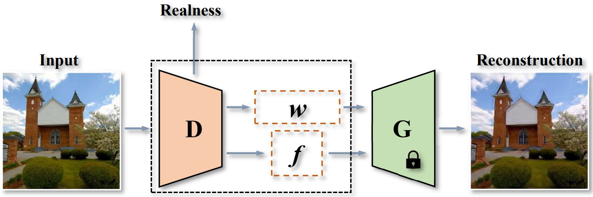

# GLeaD: Improving GANs with A Generator-Leading Task

> **GLeaD: Improving GANs with A Generator-Leading Task** <br>
> Qingyan Bai, Ceyuan Yang, Yinghao Xu, Xihui liu, Yujiu Yang, Yujun Shen <br>
> ArXiv 2022

<div align=center>

</div>


**Figure:** Concept diagram of our proposed generator-leading
task (bottom), as complementary to the discriminator-leading task
in the original formulation of GANs (upper). D is required to
extract representative features that can be adequately decoded by
G to reconstruct the input.

**[**[**Paper**](https://arxiv.org/abs/2212.03752)**]**
**[**[**Project Page**](https://ezioby.github.io/glead/)**]**

This work aims at improving Generative adversarial network (GAN) with a generator-leading task. 
GAN is formulated as a two-player game between a generator (G) and a discriminator (D), 
where D is asked to differentiate whether an image comes from real data or is produced by G. 
Under such a formulation, D plays as the rule maker and hence tends to dominate the competition. 
Towards a fairer game in GANs, we propose a new paradigm for adversarial training, 
which makes **G assign a task to D** as well. Specifically, given an image, 
we expect D to extract representative features that can be adequately decoded by G to reconstruct the input. 
That way, instead of learning freely, D is urged to align with the view of G for domain classification.

<div align=center>

</div>

## Quantitative Results


## BibTeX

If you find our work helpful for your research, please consider to cite:
```bibtex
@article{bai2022glead,
  title   = {GLeaD: Improving GANs with A Generator-Leading Task},
  author  = {Bai, Qingyan and Yang, Ceyuan and Xu, Yinghao and Liu, Xihui and Yang, Yujiu and Shen, Yujun},
  journal = {arXiv preprint arXiv:2212.03752},
  year    = {2022}
}
```
